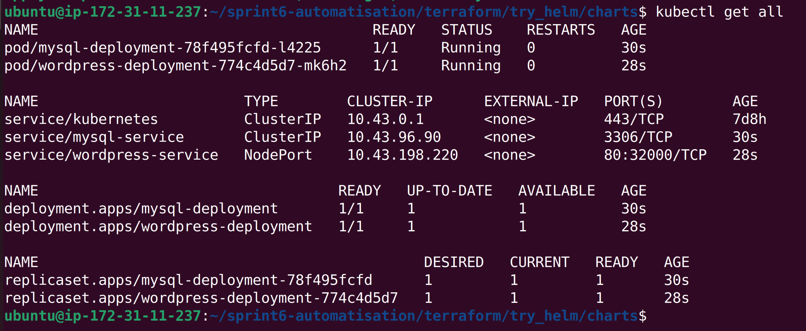

[repo parent](../README.md)
# Déploiement WordPress et MySQL sur Kubernetes avec Helm en utilisant Terraform

**Objectif :** Déployer une application WordPress complète avec sa base de données MySQL sur un cluster Kubernetes avec Helm tout en utilisant Terraform comme outil d'Infrastructure as Code.

## Pour installer Helm : 
Voir ce lien pour installer Helm :  https://github.com/a-farsi/example-install-helm

## Étapes de déploiement :
1. Créer la structure Helm pour la base de donnnées
2. Editer son deployment, le service et les valeuers variabilisées dans le fichier values.yaml 
3. Créer la structure Helm pour l'application
4. Editer son deployment, le service et les valeuers variabilisées dans le fichier values.yaml 
5. Editer le fichier de configuration _provider.tf_
6. Exécuter les commandes _terraform init_, _terraform plan_ et _terraform apply_ 

Étape 1 : Création de la structure Helm
Nous commençons par créer un chart Helm nommé mysql-chart à l’aide de la commande suivante :

```
helm create mysql-chart
```
Ensuite, nous nous déplaçons dans le répertoire créé listons son contenu avec :

```
cd mysql-chart && ls
```

Le répertoire mysql-chart contient les éléments suivants :
```
Chart.yaml, charts, templates et values.yaml
```
Nous accédons ensuite au dossier templates :

```
cd templates && ls
```

On observe plusieurs fichiers YAML générés par défaut. Comme certains ne seront pas utilisés dans notre déploiement, nous allons les supprimer. Les fichiers concernés sont :

```
NOTES.txt, hpa.yaml, ingress.yaml et serviceaccount.yaml
```

La suppression se fait avec la commande suivante :

```#bash
rm NOTES.txt hpa.yaml ingress.yaml serviceaccount.yaml
```

Nous suivons la même logique pour créer la structure Helm de notre application que nous allons appeler _wordpress-chart_, nous supprimons les fihciers que nous allons pas utiliser et nous éditons les fichiers yaml suivant : deployment, service et values.

Nous définissons le fichier _provider.tf_ pour **utiliser des charts définies en local** comme suit : 

```
provider "helm" {
  kubernetes {
    config_path = "~/.kube/config"
  }
}

resource "helm_release" "mysql" {
  name       = "mysql"
  chart      = "${path.module}/mysql-chart"
  namespace  = "default"
  create_namespace = true

  values = [
    file("${path.module}/mysql-chart/values.yaml")
  ]
}

resource "helm_release" "wordpress" {
  name       = "wordpress"
  chart      = "${path.module}/wordpress-chart"
  namespace  = "default"

  depends_on = [helm_release.mysql] # Pour s'assurer que MySQL est déployé avant

  values = [
    file("${path.module}/wordpress-chart/values.yaml")
  ]
}

``` 

### Création et affichage de l'infrastructure:

La création de l'infrastructure se fait par l'exécution des commandes

```
terraform init
terraform plan
terraform apply -auto-approve
```

Pour avoir un aperçu rapide de l'état général des ressources déployées dans notre cluster, nous exécutons la commande suivante dans le namespace default: 

```
kubectl get all
```
<p align="center">

</p>